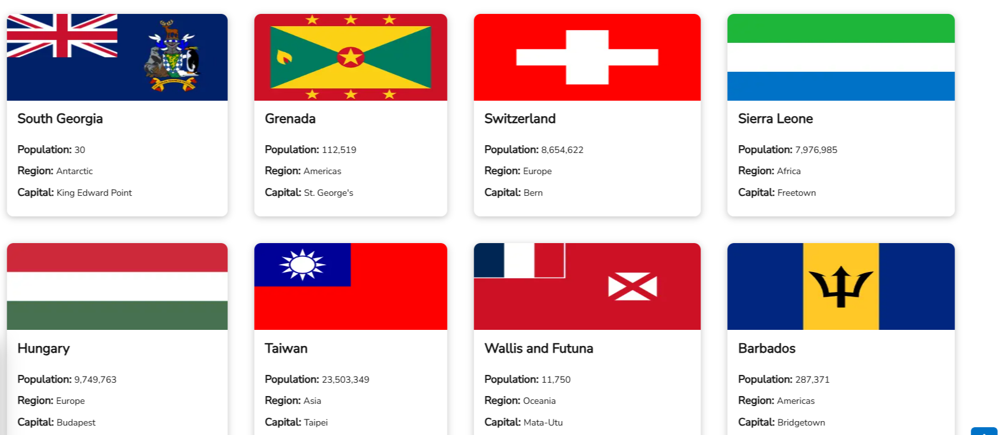

# Frontend Mentor - REST Countries API with color theme switcher solution

This is a solution to the [REST Countries API with color theme switcher challenge on Frontend Mentor](https://www.frontendmentor.io/challenges/rest-countries-api-with-color-theme-switcher-5cacc469fec04111f7b848ca). Frontend Mentor challenges help you improve your coding skills by building realistic projects.

## Table of contents

- [Frontend Mentor - REST Countries API with color theme switcher solution](#frontend-mentor---rest-countries-api-with-color-theme-switcher-solution)
  - [Table of contents](#table-of-contents)
  - [Overview](#overview)
    - [The challenge](#the-challenge)
    - [Screenshot](#screenshot)
    - [Links](#links)
  - [My process](#my-process)
    - [Built with](#built-with)
    - [What I learned](#what-i-learned)
    - [Continued development](#continued-development)
  - [Author](#author)

## Overview

### The challenge

Users should be able to:

- See all countries from the API on the homepage
- Search for a country using an `input` field
- Filter countries by region
- Click on a country to see more detailed information on a separate page
- Click through to the border countries on the detail page
- Toggle the color scheme between light and dark mode.

### Screenshot

### Links

- Solution URL: [Github Repo URL](https://github.com/MacChristo/countrypedia.git)
- Live Site URL: [Live Site URL](https://countrypedia-two.vercel.app/)

## My process

### Built with

- Semantic HTML5 markup
- CSS custom properties
- Tailwind CSS
- Flexbox
- CSS Grid
- Mobile-first workflow
- [React](https://reactjs.org/) - JS library
- [Next.js](https://nextjs.org/) - React framework
- [Styled Components](https://styled-components.com/) - For styles

### What I learned

In this project, I learnt about concepts such as filtering, color theme toggles and the use of different React methodologies.

### Continued development

I will continue to build projects to improve my skills on NextJS, ReactJS, Tailwind CSS and TypeScript.

## Author

- Website - [@MacChristo](https://github.com/MacChristo)
- Frontend Mentor - [@MacChristo](https://www.frontendmentor.io/profile/MacChristo)
- Twitter - [@KingMac_dev](https://www.twitter.com/kingMac_dev)
